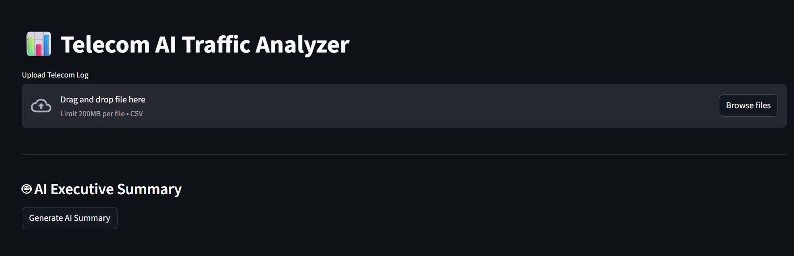
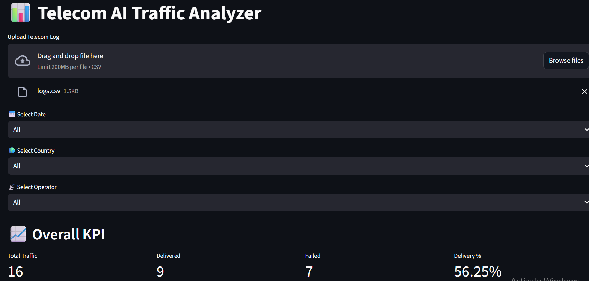
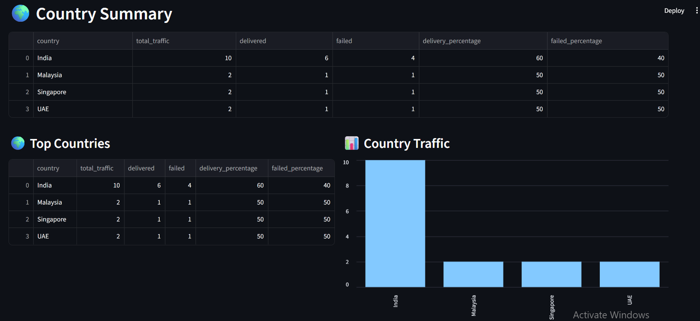
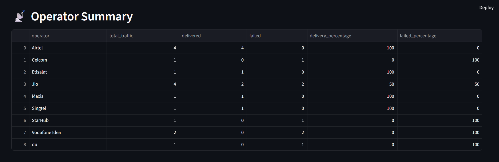
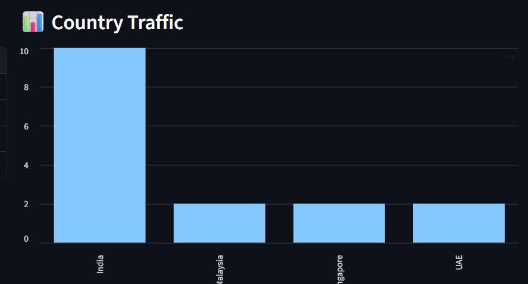
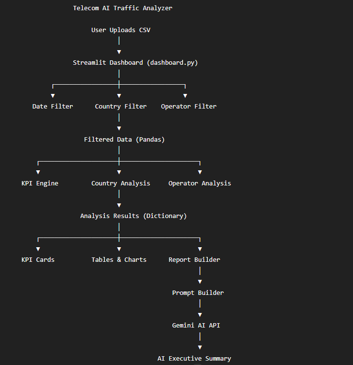

# 📊 Telecom AI Traffic Analyzer

An AI-powered telecom analytics dashboard built using **Python, Pandas, Streamlit, and Google Gemini AI**.

This application analyzes telecom messaging logs, generates key operational KPIs, provides country and operator level insights, visualizes traffic trends, and produces AI-assisted executive summaries for daily operational reporting.

---

## 🚀 Features

* 📂 Upload telecom log CSV files
* 📈 Overall KPI Dashboard

  * Total Traffic
  * Delivered Messages
  * Failed Messages
  * Delivery Percentage
* 🌍 Country-wise Analysis
* 📡 Operator-wise Analysis
* 📊 Interactive Charts
* 🔍 Filters

  * Date
  * Country
  * Operator
* 🤖 AI Executive Summary using Google Gemini
* 📄 Automated Telecom Operations Report

---

## 🛠 Technology Stack

* Python
* Pandas
* Streamlit
* Google Gemini API
* Git & GitHub

---

## 📁 Project Structure

```text
telecom-ai-traffic-analyzer/
│
├── dashboard.py
├── app.py
├── requirements.txt
├── README.md
│
├── analysis/
│   ├── kpi.py
│   ├── country_analysis.py
│   └── operator_analysis.py
│
├── ai/
│   ├── ai_engine.py
│   └── prompt_builder.py
│
├── reports/
│   └── report_builder.py
│
├── data/
│   └── sample_logs.csv
│
└── images/
```

---

## 📸 Dashboard Screenshots

### Dashboard Home



---

### Filters



---

### Country Analysis



---

### Operator Analysis



---

### Charts



---

### AI Executive Summary


---

## 🏗 Project Architecture




---

## ⚙️ Installation

Clone the repository:

```bash
git clone https://github.com/srkumar/telecom-ai-traffic-analyzer.git
```

Move into the project folder:

```bash
cd telecom-ai-traffic-analyzer
```

Install the required packages:

```bash
pip install -r requirements.txt
```

Configure your Google Gemini API key as an environment variable or in your local configuration (do not commit API keys to GitHub).

Run the Streamlit dashboard:

```bash
python -m streamlit run dashboard.py
```

---

## 📊 Sample Workflow

```text
Upload CSV
      │
      ▼
Apply Filters
      │
      ▼
Generate KPI Dashboard
      │
      ▼
Country & Operator Analysis
      │
      ▼
Interactive Charts
      │
      ▼
Generate AI Executive Summary
```

---

## 🎯 Future Enhancements

* Download AI Summary (PDF/TXT)
* Download Dashboard Report
* Plotly Interactive Charts
* Sender Analysis
* Error Code Analysis
* Account Analysis
* Traffic Spike Detection
* Daily/Weekly Trend Analysis
* AI Chat Assistant for Telecom Analytics

---

## 👨‍💻 Author

**Shashi Ranjan Kumar**

Telecom Operations | A2P Messaging | Python | Pandas | Streamlit | Generative AI

---

## ⭐ Support

If you found this project useful, consider giving the repository a ⭐ on GitHub.
